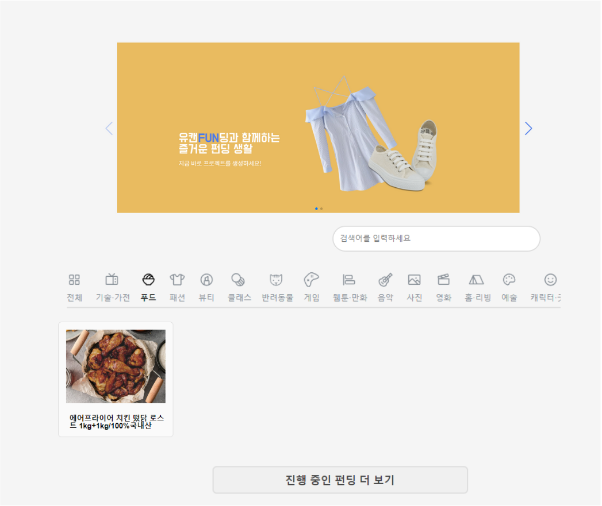
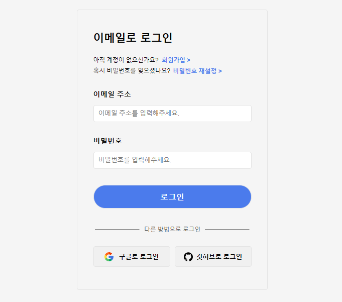
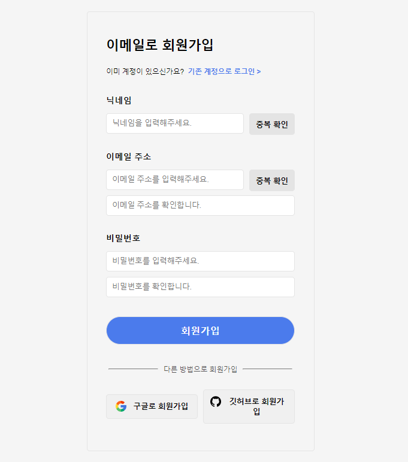
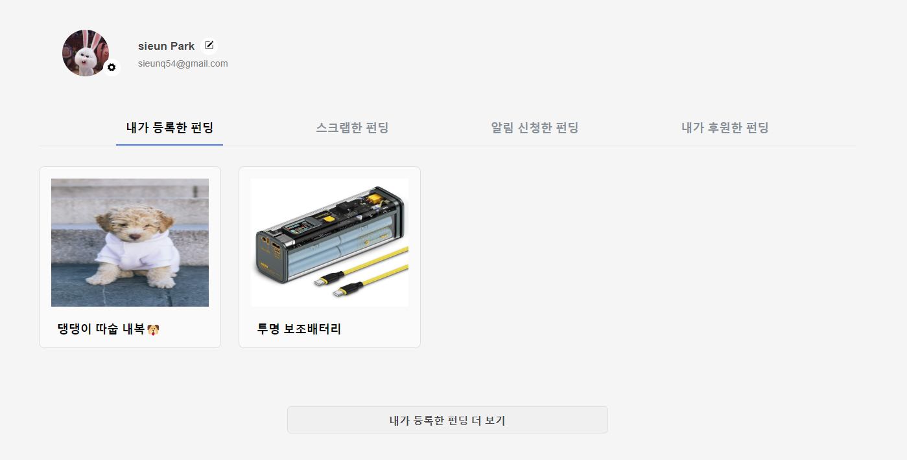
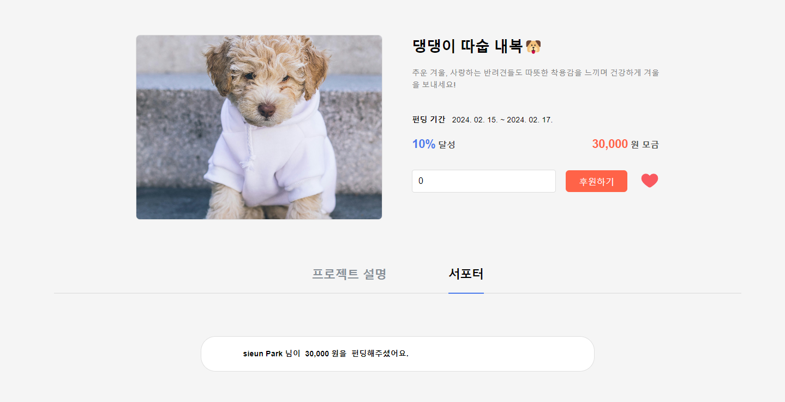
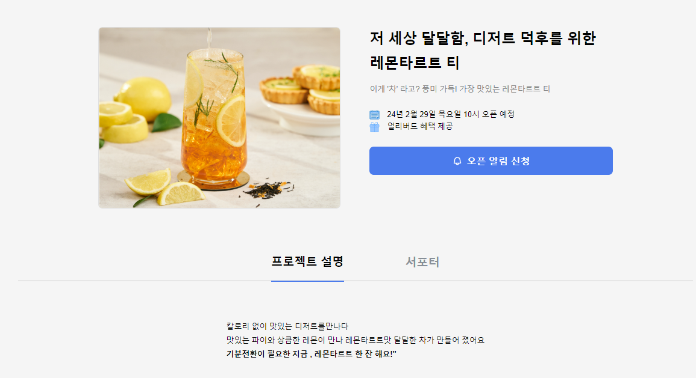
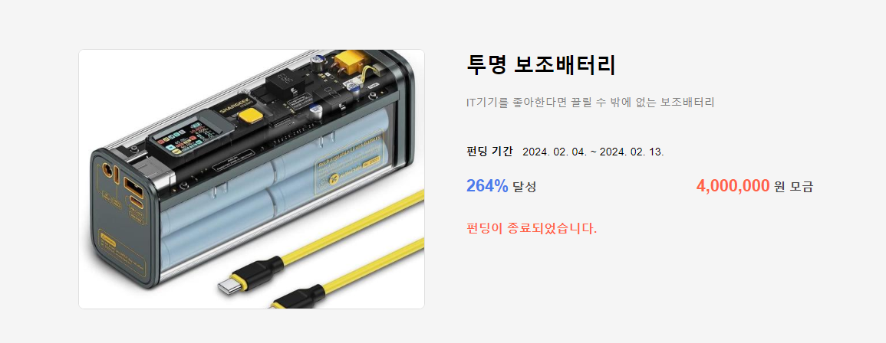

## 🖥️ 프로젝트 소개

대중들로부터 프로젝트에 대한 투자를 받는 크라우드 펀딩(Crowd Funding) 플랫폼. 

 

## 🎀 팀원 소개

|                                                박시은                                                |                                                김현주                                                |                                                장지영                                                |                                                조진훈                                                |
| :--------------------------------------------------------------------------------------------------: | :--------------------------------------------------------------------------------------------------: | :--------------------------------------------------------------------------------------------------: | :--------------------------------------------------------------------------------------------------: |
| 

 | 

 | 

 | 

 |
|                            [@MyNameSieun](https://github.com/MyNameSieun)                            |                                  [@HY965](https://github.com/HY965)                                  |                               [@JIYOUNG](https://github.com/Zzzzyoung)                               |                               [@G-NooN Jo](https://github.com/G-NooN)                                |
|                                                 팀장                                                 |                                                 팀원                                                 |                                                 팀원                                                 |                                                 팀원                                                 |
|                                               Frontend                                               |                                               Frontend                                               |                                               Frontend                                               |                                               Frontend                                               |

 

## ⏰ 개발 기간

2024.02.08 ~ 2024.02.15 (7일)

 

# ⚙️ 사용 기술

   

 

## 🗒️ 구현 항목

### 🔽 메인페이지

- 검색 기능
  - 사용자가 입력한 검색어에 따라 프로젝트 목록을 필터링하여 표시합니다.
- 카테고리 필터링
  - 선택한 카테고리에 따라 프로젝트 목록이 필터링됩니다.
- 프로젝트 목록 표시 및 이동
  - 카테고리, 진행 중 / 예정 / 종료 상태 및 검색어에 따라 동적으로 필터링됩니다.
    각 프로젝트 카드를 클릭시 해당 프로젝트의 상세 페이지로 이동합니다.
- 더보기
  - 더 보기 버튼을 클릭하면 표시되는 프로젝트 수가 증가합니다.
    버튼 텍스트는 현재 선택된 탭에 따라 동적으로 변경됩니다.

| 

 |
| ----------------------------------------------------------------------------------------- |

 

### 🔽 로그인

- 이메일 로그인
  - 사용자는 이메일과 비밀번호를 입력하여 로그인할 수 있습니다.
  - 이미 로그인한 경우 경고 메시지를 표시하고, 로그인이 실패하면 에러 메시지를 표시합니다.
- 비밀번호 재설정
  - 사용자는 이메일을 입력하고 "비밀번호 재설정" 버튼을 클릭하여 비밀번호를 재설정할 수 있습니다.
  - 이메일이 입력되지 않은 경우 경고 메시지를 표시하고, 재설정 이메일이 성공적으로 전송되면 알림 메시지를 표시합니다.
- 소셜 로그인

  - 사용자는 각각 "구글로 로그인" 또는 "깃허브로 로그인" 버튼을 클릭하여 해당 계정을 통해 로그인할 수 있습니다.
  - 처음 로그인하는 경우, 사용자 정보를 Firestore에 추가합니다.  

| 

 |
| ------------------------------------------------------------------------------------------ |

 

### 🔽 회원가입

- 닉네임 유효성 검사
  - 사용자가 닉네임을 입력하면, 해당 닉네임의 길이, 조건(한글, 영문 대소문자, 숫자만 허용), 중복 여부를 검사합니다.
- 비밀번호 및 이메일 유효성 검사
  - 사용자가 비밀번호 및 이메일을 입력하면, 비밀번호의 길이, 조건 및 이메일 유효성을 검사합니다.
- 소셜 회원가입
  - Firebase Authentication의 Google 및 GitHub provider를 사용하여 구글이나 깃허브로 회원가입 할 수 있도록 합니다.

| 

 |
| -------------------------------------------------------------------------------------------- |

 

### 🔽 프로젝트 생성

- 카테고리 선택
  - 카테고리를 선택하면 프로젝트 생성 완료시 해당 카테고리에 속하는 프로젝트만 출력됩니다.
- 프로젝트 정보 입력
  - 사용자는 카테고리, 제목, 프로젝트 개요, 메인 이미지를 입력하여 프로젝트 정보를 입력할 수 있습니다.
- 목표 금액
  - 목표 금액은 숫자로 입력되며, 입력된 값은 천 단위로 쉼표가 추가되어 표시됩니다.
- 펀딩 기간
  - 펀딩 시작일과 펀딩 종료일을 입력할 수 있습니다.
    펀딩 종료일은 펀딩 시작일 이후의 날짜로만 선택 가능합니다.
- Quill을 사용한 텍스트 에디터
  - react-quill 패키지를 사용하여 텍스트 에디터를 구현하였습니다.

| 

 |
| ------------------------------------------------------------------------------------------------- |

 

### 🔽 마이페이지

- 프로필 이미지 및 닉네임 수정
  - 사용자는 프로필 이미지를 업로드하고, 닉네임을 수정할 수 있습니다.
- 탭 선택
  - 사용자는 마이페이지에서 특정 탭을 선택하여 해당하는 펀딩 목록을 볼 수 있습니다.
- 프로젝트 목록 표시
  - DB에서 가져온 프로젝트 목록을 해당 탭에 따라 필터링하여 표시합니다.
  - 프로젝트 카드를 클릭하면 해당 프로젝트의 세부 페이지로 이동합니다.

| 

 |
| ---------------------------------------------------------------------------------------------- |

 

### 🔽 Post

> 펀딩 진행중

- 후원하기
  - 사용자는 로그인 한 상태에서 후원 금액을 입력하여 프로젝트에 후원할 수 있습니다.
- 후원 총액 표시
  - 현재까지의 후원 총액이 표시됩니다.
- 스크랩 기능
  - 사용자가 하트 버튼을 클릭하면 해당 프로젝트가 스크랩되어 마이페이지에 표시됩니다.
- 서포터 목록 표시
  - 프로젝트에 참여한 사용자들의 후원 목록을 확인할 수 있습니다.

| 

 |
| ---------------------------------------------------------------------------------------------- |

 

> 펀딩 예정

- 오픈 예정일 및 혜택
  - 오픈 예정일 및 혜택에 대한 정보를 제공합니다.
- 오픈 알림 신청 및 취소
  - 프로젝트에 대한 오픈 알림을 신청하거나 취소할 수 있습니다.
  - 신청한 오픈 알림은 메인페이지에 표시됩니다.

| 

 |
| -------------------------------------------------------------------------------------------- |

 

> 펀딩 종료

- 후원 달성률 및 모금액 표시
  - 후원 달성률 및 모금액이 표시됩니다.
  - 펀딩이 완료된 프로젝트는 더 이상 후원이 불가합니다.

| 

 |
| -------------------------------------------------------------------------------------------- |

 

## 🌟 트러블 슈팅

> 문제 1

- 문제 현상
  - React 함수형 컴포넌트에서 useEffect 내부에서 직접 async 키워드를 사용하여 비동기 작업을 수행하려고 했을 때 오류가 발생하였습니다.
- 문제 원인
  - useEffect는 반환된 Promise의 완료를 기다리지 않기 때문에, async 함수를 사용하더라도 해당 함수가 완료되기를 기다리지 않고 다음 코드로 즉시 진행되기 때문이였습니다.
- 해결 방법
  - useEffect 내부에서 직접 async 함수를 사용할 수 없으므로, 새로운 함수를 선언하고
    그 안에서 async/await를 사용하여 비동기 작업을 처리하여 해결하였습니다.

 

> 문제 2

- 문제 현상
  - Firestore DB의 데이터를 useEffect 를 사용하여 가져온 뒤, 세부 페이지에 렌더링하여 정상적으로 출력되는 것을 확인했으나, 새로고침을 수행하면 렌더링된 내역이 출력되지 않고 에러가 발생하였습니다.
- 문제 원인
  - 기존 코드에서는 jsx에서 DB로부터 가져온 데이터를 출력한 후, useEffect 를 사용하여 DB로부터 데이터를 가져왔습니다.
  - 하지만, useEffect 는 jsx 부분이 페이지에 출력 (mount)된 이후에 수행되기 때문에, 기존 코드의 jsx 부분은 useEffect가 완료되기 전까지는 DB로부터 완전히 가져오지 않은 데이터를 출력하려 시도하기 때문에 에러가 발생하였습니다.
- 해결 방법
  - useEffect 의 로직이 수행 완료될 때까지 출력할 별도의 jsx 부분을 생성하여 출력하여 해결하였습니다.

 
